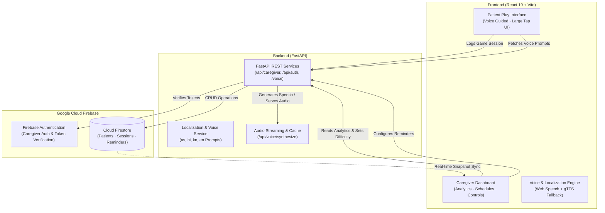

# 🧠 SMRITHI (স্মৃতি)
### AI-Based Cognitive Gaming & Memory Assistance Platform for Elderly Dementia Patients in the North Eastern Region (NER)

[](https://www.sih.gov.in/)
[](https://fastapi.tiangolo.com/)
[](https://react.dev/)
[](https://vitejs.dev/)
[](https://firebase.google.com/)
[](https://www.python.org/)

---

## 📌 Executive Summary

**SMRITHI (স্মৃতি / SPARSH)** is a digital therapeutic platform specifically designed to address the severe cognitive healthcare gap in India's **North Eastern Region (NER)**. While conventional cognitive rehabilitation software relies on Western paradigms and English-only interfaces, SMRITHI provides a **culturally rooted, multilingual, voice-assisted** memory care companion. 

Developed under **Smart India Hackathon 2026 (Problem Statement: SIH26003)**, SMRITHI empowers elderly dementia patients through non-intimidating cognitive games while equipping home caregivers with real-time tracking, medication adherence tools, and doctor-ready cognitive trend reports.

---

## 🚨 The Healthcare Crisis in NER

```
┌────────────────────────────────────────────────────────────────────────┐
│                        THE REGIONAL CARE GAP                           │
├────────────────────────────────┬───────────────────────────────────────┤
│ 8.8 Million Indians (60+)      │ 7.4% national dementia prevalence      │
│ 0.35 Neurosurgeons / Million   │ NER has only 55 neurosurgeons total   │
│ 0 Neurosurgeons in Mizoram     │ Complete absence in multiple states   │
│ 90% Treatment & Care Gap       │ Most rural families manage solo       │
└────────────────────────────────┴───────────────────────────────────────┘
```

1. **Severe Neurological Shortage:** The 8 North Eastern states have only 55 practising neurosurgeons combined (0.35 per million vs national average of 1.0 per million).
2. **Cultural & Linguistic Alienation:** Existing cognitive apps (e.g., Lumosity, Western clinical software) confuse elderly NER patients with foreign imagery (subways, Western utensils) and lack vernacular speech support.
3. **Geographical Isolation & Low Connectivity:** Remote hill terrain and intermittent internet access make specialist consultations rare and costly.

---

## 💡 The SMRITHI Solution & Differentiators

* **Genuine Cultural Adaptation:** Games feature regional weaving patterns (*Gamusa* motifs), traditional kitchen items (*Dheki*, *Bhogjora*, *Khorahi*), local bazaar recall (*Assam Tea*, *Bamboo Shoots*, *Ginger*), and folk music.
* **Dual-User Architecture:** 
  * **Patient View (Player):** Simple, high-contrast, large tap targets, audio-guided voice prompts, zero confusing menus.
  * **Caregiver View (Controller):** Administrative panel to adjust difficulty, schedule medicines/hydration, and track cognitive stability.
* **Multilingual Voice Assistance:** Voice synthesis and pre-recorded prompts in regional languages (Assamese **অসমীয়া**, Hindi, Kannada, English).
* **Real-Time Synchronisation:** Instant Firestore synchronization between patient game sessions and the caregiver monitoring dashboard.
* **Doctor-Reviewable Progress Reports:** Quantifies memory accuracy, reaction times, and routine adherence to make rare specialist consultations maximally actionable.

---

## 🎮 Cognitive Games & Modules

SMRITHI features five targeted cognitive exercises designed around daily living activities (ADLs):

| Game Module | Cognitive Domain | Cultural / Regional Context |
|---|---|---|
| **🃏 Memory Match** | Short-term Visual Memory & Concentration | Matching cards featuring tea gardens, traditional hornbills, masks, and regional crafts. |
| **🔍 Recognition Game** | Semantic Memory & Familiar Object Recall | Identifying daily objects, regional fruits, traditional attire, and personalized family portraits. |
| **🔄 Sequence Recall** | Executive Function & Procedural Memory | Reconstructing sequential daily routines (e.g., morning tea preparation, bathing, market visits). |
| **🎨 Folk Motif Match** | Visual-Spatial Pattern Recognition | Identifying traditional Assamese & North Eastern textile patterns (*Gamusa*, *Muga Silk* motifs). |
| **🍲 Regional Kitchen Game** | Association & Daily Living Recall | Traditional utensil identification and local Sunday bazaar shopping list memory recall. |

---

## 🛠️ System Architecture



---

## 💻 Tech Stack

### Frontend
* **Core:** React 19, JavaScript (ES6+)
* **Build System:** Vite 8.2+
* **Routing & State:** React Router v7, React Context API
* **Animations:** Framer Motion
* **Icons & Styling:** Lucide React, Custom Responsive Design Tokens (Dark & Light Accessible Palettes)
* **Audio & Voice:** HTML5 Web Audio API, Web Speech Synthesis API

### Backend
* **Framework:** FastAPI (Python 3.10+)
* **Server:** Uvicorn / Gunicorn
* **Validation & Schemas:** Pydantic v2 & Pydantic Settings
* **Speech Synthesis:** gTTS (Google Text-to-Speech) + Audio Caching Pipeline
* **HTTP Client:** HTTPX

### Cloud & Database
* **Database:** Google Cloud Firebase Firestore (NoSQL Real-Time Sync)
* **Authentication:** Firebase Admin SDK & Firebase Client Auth

---

## 🗺️ Roadmap & Future Vision

- [x] **Phase 1 (Core MVP):** Dual-user interface, 5 regional cognitive games, Firestore real-time sync, gTTS multilingual voice engine, caregiver reminders.
- [ ] **Phase 2 (AI/ML Trend Analysis):** Scikit-learn cognitive performance classifier to evaluate multi-week domain trends (*improving*, *stable*, *declining*) for medical consultations.
- [ ] **Phase 3 (LLM Memory Synthesis):** Automated generation of personalized family trivia and memory recall questions based on caregiver-provided facts.
- [ ] **Phase 4 (ASR Voice Answers):** Speech-to-text response recognition for hands-free conversational therapy in regional dialects.
- [ ] **Phase 5 (Offline First Mesh Sync):** Local SQLite / IndexedDB sync for completely disconnected rural health centres.

---

## 👥 Team & Acknowledgements

Developed with ❤️ for the **Smart India Hackathon 2026**.

* **Problem Statement:** SIH26003 — AI-Based Cognitive Gaming & Memory Assistance Platform for Elderly Dementia Patients in the North Eastern Region.
* **Special Thanks:** Healthcare practitioners and caregivers across the North Eastern states whose insights guided our accessibility and localization standards.

---

## 📄 License

This project is licensed under the **MIT License** — see the [LICENSE](LICENSE) file for details.